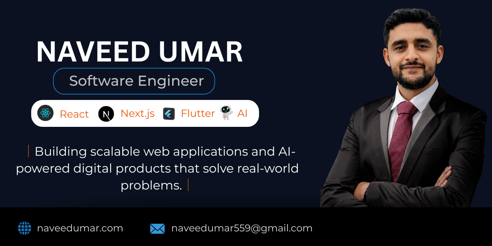

  

<h1 align="center">Hi 👋 I'm Naveed Umar</h1>

Software Engineer • React • Next.js • Flutter • AI

Building scalable web applications and AI-powered digital products that solve real-world problems.

---

# 🚀 Who I Am

I'm a Software Engineering 8th semseter student passionate about building modern web applications, AI-powered products, and digital experiences.

Instead of only writing code, I enjoy solving business problems through clean architecture, intuitive UI, and scalable solutions.

Currently looking for a **Junior Remote Software Engineering** opportunity.

---

# 🛠 My Toolbox

### Languages

### Frontend

### Mobile

### Backend & Database

### Tools

---

# 💼 Featured Projects

| Project | Description | Tech |
|:--|:--|:--|
| 🌐 **Portfolio** | Personal portfolio showcasing my projects and experience. | Next.js • Tailwind |
| 🏥 **Edina Eye Clinic** | Modern healthcare website with premium UI/UX. | Next.js |
| 💼 **BeyByte** | Agency website focused on conversions and branding. | React |
| 📱 **Fitnex** | Flutter mobile application with authentication,AI bot integration and responsive UI. | Flutter |

---

# 📊 GitHub Statistics

---

# 🎯 Current Focus

- 🚀 Building production-ready React & Next.js applications
- 📱 Developing scalable Flutter apps
- 🤖 Exploring AI integrations
- 📚 Improving software architecture skills
- 🌍 Seeking remote software engineering opportunities

---

# 🤝 Let's Connect

<a href="https://naveedumar.com">
Portfolio
</a>
•
<a href="https://www.linkedin.com/in/naveed-umar-565abb27a/">
LinkedIn
</a>
•
<a href="mailto:naveedumar559@gmail.com">
Email
</a>

---

⭐ If you like my work, consider following my GitHub journey.

